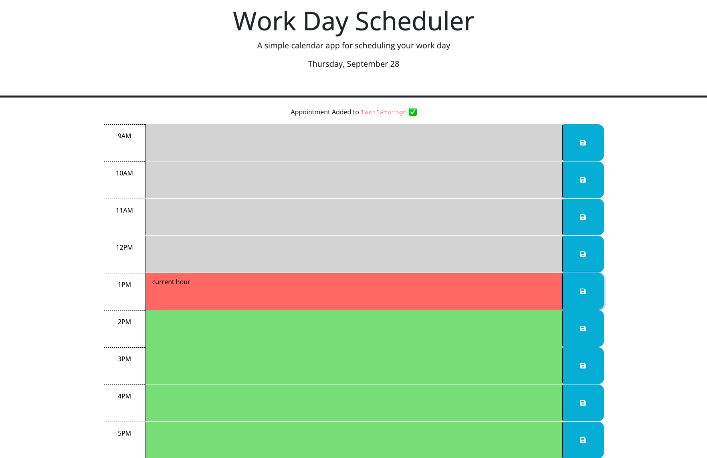

# Work Day Scheduler

## Description

This is a daily planner that allows the user to save appointments for each hour of a typical working day (9am–5pm).

## [Deployed Website](https://ingridmidia.github.io/work-day-scheduler/)

